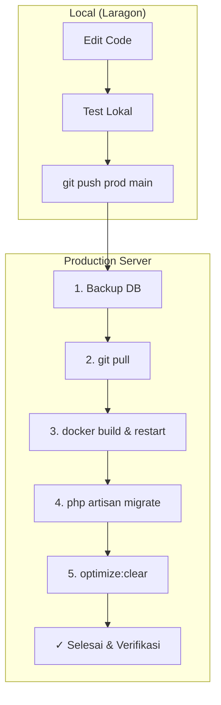

# 🔒 Master Deployment Guide: Library-ISO

// turbo-all

> [!IMPORTANT]
> File ini adalah panduan tunggal (Single Source of Truth) untuk deployment. Gunakan `/safe-deploy` untuk menjalankan workflow ini.

---

## 🛡️ Aturan Emas (Safety Rules)

| Masalah | Penyebab | Solusi |
|---------|----------|--------|
| **Data Terhapus** | `migrate:fresh` atau `down -v` | **JANGAN** gunakan flag `-v` atau `migrate:fresh` |
| **Aset Tidak Update** | Cache lama masih tersimpan | Jalankan `optimize:clear` & `up -d --build` |
| **Gagal Struktur DB** | Migration conflict | Backup DB sebelum `migrate` di production |

---

## 🏗️ Workflow Overview



---

## 🚀 Langkah-Langkah Eksekusi

### STEP 1: Push dari Local (Laragon)
```powershell
# Jalankan di terminal VS Code / Laragon
git add .
git commit -m "feat: deskripsi perubahan"
git push prod main
```

### STEP 2: SSH & Backup di Server
```bash
# SSH ke server
ssh peroniks@peroniks-ppicserver

# Masuk ke folder project
cd /srv/docker/apps/Library-ISO

# Backup DB (Wajib jika ada migrasi baru)
docker exec library-iso-db mysqldump -u root -p[PASSWORD] library-iso > ~/backups/before_$(date +%Y%m%d_%H%M%S).sql
```

### STEP 3: Update & Build (Production)
```bash
# Pull kode terbaru
sudo git pull origin main

# Update container (Penting untuk aset/vendor baru)
sudo docker compose up -d --build

# Jalankan migrasi baru (HANYA migrasi baru!)
sudo docker compose exec app php artisan migrate

# Clear & Optimize Cache
sudo docker compose exec app php artisan optimize:clear
sudo docker compose exec app php artisan config:cache
sudo docker compose exec app php artisan route:cache
sudo docker compose exec app php artisan view:cache
```

---

## 📋 Copy-Paste Prompt (Untuk AI Lain)
Jika Anda meminta bantuan AI lain untuk deploy, berikan prompt ini:

> "Bantu saya deploy Library-ISO. Langkahnya: git push dari local ke 'prod main'. Di server: backup DB via mysqldump, pull origin main, jalankan 'docker compose up -d --build', jalankan migrasi (bukan fresh!), dan terakhir 'php artisan optimize:clear'. JANGAN PERNAH jalankan migrate:fresh."

---

## ⚠️ Recovery (Jika Error)
```bash
# Restore Database
docker exec -i library-iso-db mysql -u root -p[PASSWORD] library-iso < ~/backups/file_backup.sql

# Rollback Code
git reset --hard HEAD~1
docker compose up -d --build
```
